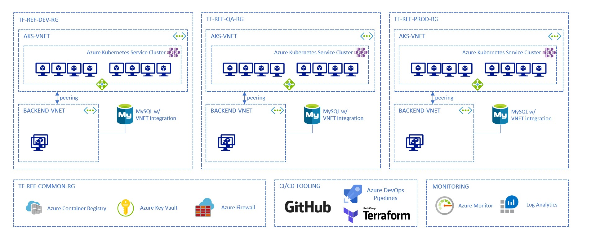

# Terraform on Azure

To implement Infrastructure as Code best practices using Terraform and Microsoft Azure.

If you are not familiar with Infrastructure as Code (IaC), read [this page](https://docs.microsoft.com/en-us/azure/devops/learn/what-is-infrastructure-as-code) first.

# Prerequisites

- A Microsoft Azure account. You can create a free trial account [here](https://azure.microsoft.com/en-us/free/).

- An Azure DevOps organization for free [here](https://azure.microsoft.com/en-us/services/devops/?nav=min) if you do not already use Azure DevOps

- Install the [Azure CLI](https://docs.microsoft.com/en-us/cli/azure/install-azure-cli?view=azure-cli-latest)

- [Install Terraform](https://developer.hashicorp.com/terraform/install)

If you are not familiar with Terraform or kubenetes fundamentals yet, You may follow the 

- Terraform for Azure Beginners: Ultimate guide on [this page](https://medium.com/@venkatsunilm/terraform-for-azure-beginners-from-basics-to-best-practices-f5617259f41c).

- Kubernetes Beginners: Ultimate guide on [this page](https://medium.com/@venkatsunilm/terraform-for-azure-beginners-from-basics-to-best-practices-f5617259f41c).

- [Terraform modules](https://www.terraform.io/docs/modules/index.html) are used to group together a set of resources that have the same lifecycle. It is not mandatory to use modules, but in some case it might be useful.

If you are not familiar with Azure resource groups, Docker, Networking or SSH. I recommend to get some knowledge to understand this better. You may follow my articles below. 

- [A Beginner’s Introduction to Docker](https://medium.com/@venkatsunilm/a-beginners-introduction-to-docker-6faa40afddb9)

- [Unlock Remote Worlds: The Ultimate Guide to SSH for Beginners](https://medium.com/@venkatsunilm/unlock-remote-worlds-the-ultimate-guide-to-ssh-for-beginners-6c7d5ea44c0d)

- [Networking on the Microsoft Azure Cloud](https://medium.com/@venkatsunilm/azure-virtual-networks-vnet-comprehensive-beginners-guide-79449029f6a5)

- [Building Your Cloud Castle: Azure Resources and Resource Groups](https://medium.com/@venkatsunilm/building-your-cloud-castle-azure-resources-and-resource-groups-ba466a1f9303)

- [Essential Git Command list (with explanations!)](https://medium.com/@venkatsunilm/essential-git-command-list-with-explanations-e9d02661dedc)

# Overview of the architecture

*Here our focus will be on deploying the infrastructure*

This repository guides you in deploying the following architecture on Microsoft Azure.

There are 3 environments (Dev, QA and Prod). Each of the environment contains:

- An [Azure Kubernetes Service](https://docs.microsoft.com/en-us/azure/aks/intro-kubernetes) cluster, in its own virtual network

- A backend virtual network, that contains one or more virtual machines that act as bastion / jump boxes

- An [Azure Database for MySQL](https://docs.microsoft.com/en-us/azure/mysql/overview) service instance with [virtual network service endpoint](https://docs.microsoft.com/en-us/azure/mysql/concepts-data-access-and-security-vnet) so it can be reached by jumbbox and services running in AKS (Backend virtual network and AKS virtual network are peered together)

There are also common services used here:

- [Azure Container Registry](https://docs.microsoft.com/en-us/azure/container-registry/), to store the Docker image

- [Azure KeyVault](https://docs.microsoft.com/en-us/azure/key-vault/), to store the application secrets securely

- [Azure Firewall](https://docs.microsoft.com/en-us/azure/firewall/), to protect the application

We will also use [Azure Monitor](https://docs.microsoft.com/en-us/azure/azure-monitor/) with logs analytics to monitor all this infrastructure (and potentially the application).

Finally, all the infrastructure will be describe using Terraform HCL manifests stored in GitHub (this repository) and we will use [Azure DevOps Pipelines](https://docs.microsoft.com/en-us/azure/devops/pipelines/get-started/overview?view=azure-devops) to deploy all the infrastructure.

*Note: technically speaking, the pipeline that automates Terraform deployment can be hosted in any other CI/CD tool, like Jenkins, for example.*

As you can see, some parts of the infrastructure are specific for each environment, some other will be shared. This will help to illustrate how to handle deployments of different resources having different lifecycle.

# Terraform State

Terraform needs to maintain state between the deployments, to make sure to what needs to be added or removed.

Storing Terraform state remotely is a best practice to make sure you don't loose it across your different execution environment (from your machine to any CI/CD agent). 

It is possible to use Azure Storage or any other cloud services or Terraform cloud itself as a remote backend for Terraform state.

To initialize the the Azure Storage backend, you have to execute the [scripts/init-remote-state-backend.sh](scripts/init-remote-state-backend.sh). Please have a look at it. 

This script is responsible for:
- Creating an Azure Resource Group
- Creating an Azure Storage Account
- Retrieving the Storage Account access key
- Creating a container in the Storage Account (where the Terraform state will be stored)
- Creating an Azure Key Vault
- Storing the the Storage Account access key into a Key Vault secret named `tfstate-storage-key`

Once completed, you may notice the above scripts will be displaying the `terraform init` command line that you will use later to init Terraform to use this backend. 

*Note: If you are working with multiple cloud providers, you may not want to spare storage state into each provider. For this reason, you may want to look the [Terraform Cloud remote state management](https://www.hashicorp.com/blog/introducing-terraform-cloud-remote-state-management) that has been introduced by HashiCorp.*

# Terraform modules

## What are Terraform modules?

[Terraform modules](https://www.terraform.io/docs/modules/index.html) are used to group together a set of resources that have the same lifecycle. It is not mandatory to use modules, but in some case it might be useful.

Like all mechanisms that allow to mutualize/factorize code, modules can also be dangerous: you don't want to have a big module that contains everything that you need to deploy and make all the resources strongly coupled together. This could lead to a monolith that will be really hard to maintain and to deploy.

Here are some questions that you can ask yourself for before writing a module:
- Do have all the resources involved the same lifecycle?
  - Will the resources be deployed all together all the time?
  - Will the resources be updated all together all the time?
  - Will the resources be destroyed all together all the time?
- Is there multiple resources involved? If there is just one, the module is probably useless
- From an architectural/functionnal perspective, does it makes sense to group all these resources together? (network, compute, storage etc...)
- Does any of the resource involved depend from a resource that is not in this module?

If the answer to these questions is `no` most of the time, then you probably don't need to write a module.

Sometime, instead of writing a big module, it can be useful to write multiple ones and nest them together, depending on the scenario you want to cover.

# Modules of this architecture 

This architecture uses different Terraform module to deploy different set of components and deal with their different lifecyle:

## Common Module 

It contains all the common resources like ACR, KeyVault...
This module is defined in its own [GitHub repository](https://github.com/venkatsunilm/terraform-azure-common-module).

More documentation [here](tf/common/README.md).

## Core Environment Module

It contains the base components for an environment (resource group, network...).
More documentation [here](tf/core/README.md).

## Azure Kubernetes Service Module

It contains everything needed to deploy an Azure Kubernetes Service cluster inside a given environment.
It is defined in its own [GitHub repository](https://github.com/venkatsunilm/terraform-azure-aks-module).

More documentation [here](tf/aks/README.md).